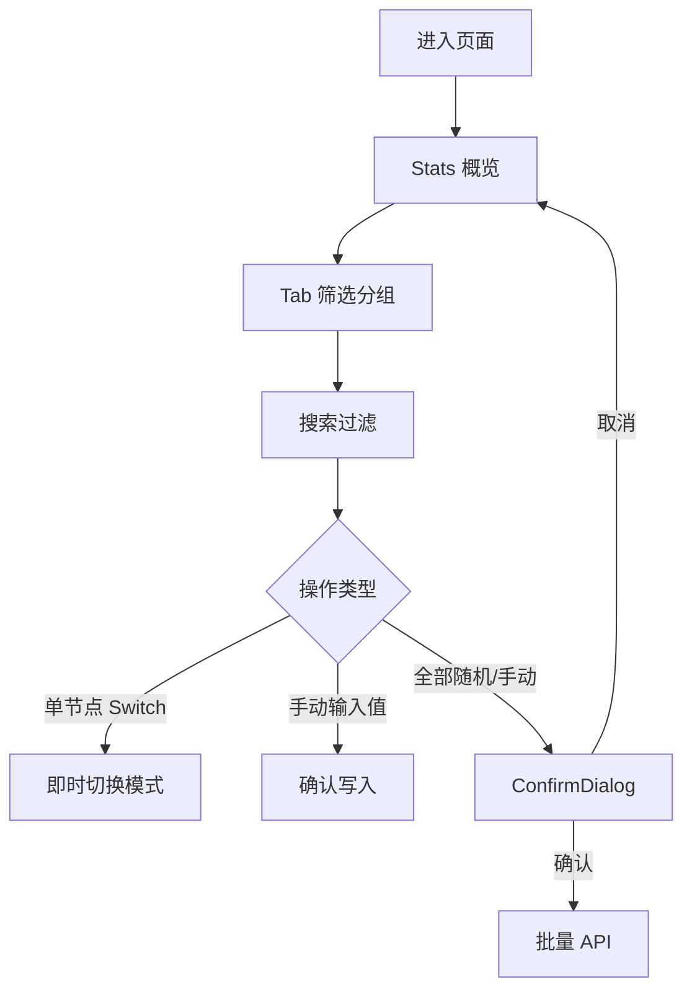

# OPC 模拟器 · 统一设计语言

> 版本 1.0 · 移动端 + 桌面端同一套 Design System

---

## 1. 设计目标

| 目标 | 说明 |
|------|------|
| **同一语言** | 移动端与桌面端共用组件、色板、间距、语义，仅布局响应式变化 |
| **语义清晰** | 颜色只表达「模式/状态」，导航与数值不再滥用 accent 色 |
| **现场可用** | 1674 节点可检索、可滚动、批量操作有确认、触控区 ≥ 44px |
| **工业气质** | 深色监控风 + 等宽数值 + 克制装饰，非通用 Admin 模板 |

---

## 2. 色彩系统（Semantic Tokens）

```
背景层级
  --bg          #0a0e14   页面底
  --surface     #111822   卡片/面板
  --surface2    #1a2332   表头/悬停
  --surface3    #243044   激活 Tab、输入框底

边框
  --border      #2a3a50
  --border-light #3a4a60

文字
  --text        #e8edf4   主文字、当前值
  --text-secondary #8899aa  次要
  --text-muted  #5a6a7a   标签、占位

功能色（严格分工）
  --nav-active  #e8edf4   导航选中（中性，不用青绿）
  --mode-random / --cyan  #00d4aa   仅：随机模式徽章、Switch、左侧色条
  --mode-manual / --orange #f59e0b   仅：手动模式徽章、Switch、左侧色条
  --danger      #ef4444   批量操作确认、破坏性提示
```

**色彩使用规则**

| 场景 | 颜色 |
|------|------|
| Tab 选中 | 中性 `--nav-active` + `--surface3` 底 |
| 统计数字（总量） | `--text` |
| 统计数字（随机/手动） | 对应模式色 |
| 节点当前值 | `--text`（不用 cyan） |
| 模式标识 | Badge + 色条 + Switch 三色一致 |

---

## 3.  typography

| 层级 | 移动端 | 桌面端 | 用途 |
|------|--------|--------|------|
| H1 | 14px semibold | 14px semibold | 页面标题 |
| Label | 11px medium | 11px uppercase tracking | 字段标签 |
| Body | 14px | 14px | 节点名 |
| Value | 16px mono bold | 14px mono bold | 当前值 |
| Stat Hero | 24px mono | 30px mono | 统计大数 |

字体栈：`Inter, SF Pro, system-ui` + 数值 `font-mono`

---

## 4. 间距与圆角

- 页面边距：移动 `12px` / 桌面 `16–24px`
- 卡片圆角：`12px`（rounded-xl）
- 组件间距：`12px`（gap-3）
- 列表卡片间距：移动 `8px` / 桌面表格行高 `48px`
- 底部安全区：`pb-[env(safe-area-inset-bottom)]`

---

## 5. 组件规范

### 5.1 Header

```
┌──────────────────────────────────────────────────┐
│ [icon] OPC 模拟器          [全部随机] [全部手动] │
│        Mining… (仅 sm+)    [运行中·1674] (仅 sm+)│
└──────────────────────────────────────────────────┘
```

- 移动端隐藏英文副标题与运行状态条，释放空间
- 「全部随机 / 全部手动」点击 → **ConfirmDialog** 二次确认
- 批量按钮：`outline` 风格，非实心，降低误触视觉权重

### 5.2 Stats（响应式同一数据）

**桌面（≥640px）**：三卡 grid，保留进度条

**移动（<640px）**：单条摘要卡

```
┌─────────────────────────────────────────┐
│ 1674          随机 1674 · 100%          │
│ 总节点        手动 0 · 0%               │
│ [━━━━━━━━━━●] 随机 ████████████ 100%   │
│               手动 ░░░░░░░░░░░░ 0%      │
└─────────────────────────────────────────┘
```

### 5.3 TabBar

- 选中：中性高亮（surface3 + 白字），**不用 cyan**
- 右侧渐变遮罩提示可横滑
- count 徽章：中性底，选中时略亮

### 5.4 SearchBar

- 左侧搜索图标 + 输入框
- 有内容时右侧 **清除 ×**
- 下方：`共 N 条节点` / `找到 N 条`（有搜索词时）

### 5.5 ModeSwitch（共享）

- 尺寸：移动 `56×32px`，桌面 `48×24px`
- `role="switch"` + `aria-checked` + `aria-label`
- 可选旁侧 ModeBadge：`随机` / `手动`

### 5.6 节点行 / 卡片（共享 ValueField）

**桌面表格**

| 色条 | 序号 | 节点名称 | 模式 Switch + Badge | 当前值 |
|------|------|----------|---------------------|--------|

**移动卡片**

```
┌─│────────────────────────────────────┐
│ │ 采煤机_运行                         │
│ │ [随机] [Switch]      当前值         │
│ │                       0             │
└─│────────────────────────────────────┘
```

- 左侧 4px 色条：随机 cyan / 手动 orange
- 「当前值」小标签 + 等宽数值
- 手动模式：输入框 + 确认按钮（触控高度 44px）

### 5.7 ConfirmDialog

- 遮罩 `rgba(0,0,0,0.6)` + 居中卡片
- 标题 + 说明（含节点数）+ 取消 / 确认
- 确认批量切换使用 `--danger` 或模式色按钮

---

## 6. 布局断点

| 断点 | 布局 |
|------|------|
| `< 640px` | 摘要 Stats + 卡片列表 + 虚拟滚动 |
| `≥ 640px` | 三卡 Stats + 表格 + 虚拟滚动 |
| `≥ 1024px` | 内容区 max-width 1400px 居中 |

---

## 7. 交互流程



---

## 8. 文件结构（实现）

```
src/
  components/
    Header.jsx          # + ConfirmDialog 触发
    Stats.jsx           # 响应式双布局
    TabBar.jsx          # 中性选中 + scroll fade
    SearchBar.jsx       # 清除 + 计数
    ConfirmDialog.jsx   # 新建
    ModeSwitch.jsx      # 新建
    ModeBadge.jsx       # 新建
    ValueField.jsx      # 新建
    NodeCard.jsx        # 使用共享组件
    NodeRow.jsx         # 使用共享组件
    NodeCardList.jsx    # + 虚拟滚动
    NodeTable.jsx       # 表头加标签
  hooks/
    useFilteredNodes.js # 新建，统一过滤逻辑
  index.css             # 语义 token 扩展
```

---

## 9. 设计效果图

见同目录：

- `design-mobile.png` — 375×812 移动端主屏
- `design-desktop.png` — 1440×900 桌面端主屏

---

## 10. 验收清单

- [x] 移动/桌面 Stats 数据一致、布局不同
- [x] Tab 选中不再使用 cyan
- [x] 节点值显示带「当前值」标签，数值为中性色
- [x] 批量操作有确认弹窗
- [x] 搜索显示结果数、可一键清除
- [x] 移动端列表虚拟滚动流畅
- [x] Switch 触控区 ≥ 44px（移动）
- [x] 底部 safe-area 留白
